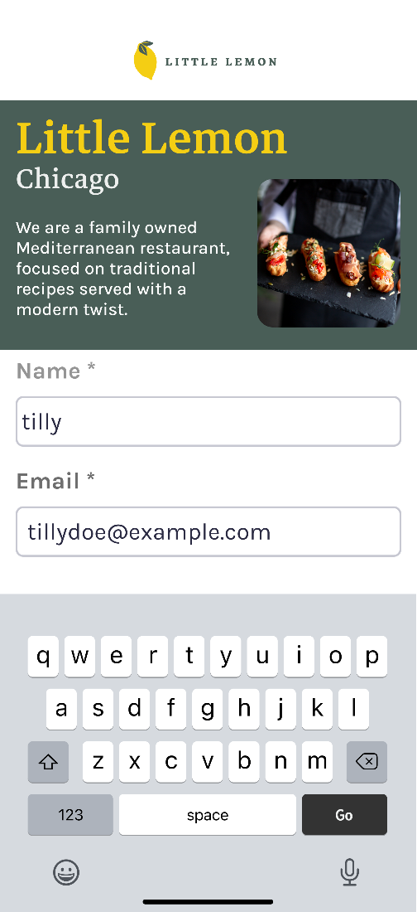
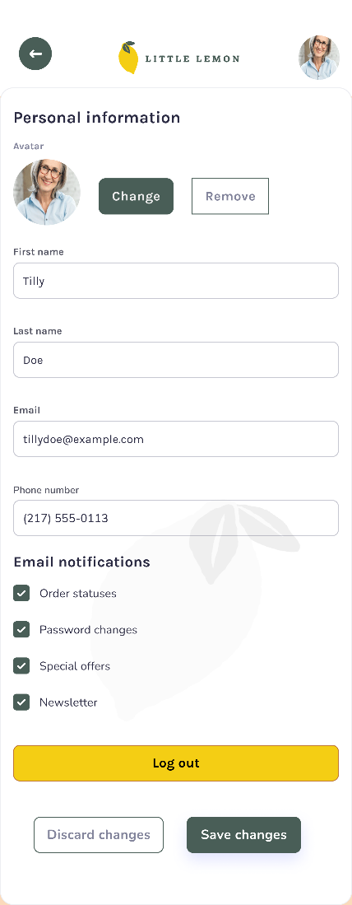

Little Lemon Restaurant App

This is the capstone project of iOS development certificate courses by Meta.

I used Figma for planning the design and, I used Git and GitHub for ensuring workflow.

I started with developing the onboarding flow enabling users to create their accounts, then I worked on setting the navigation flow.
After that, I worked on fetching data from an API and storing it locally on a mobile device using core data so that the user can interact with the application without internet connectivity.

I also worked on sorting and filtering the food items, which brought more complexity to the application but made it easier to use for the end users.

## Wirefram: 

## OnboardingScreen: 

## ProfileScreen: 

## HomeScreenDesign: 

## HomeScreen: 

## StyleGuide: 

